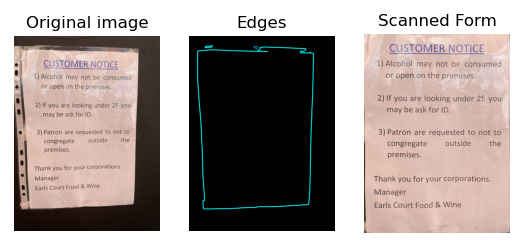
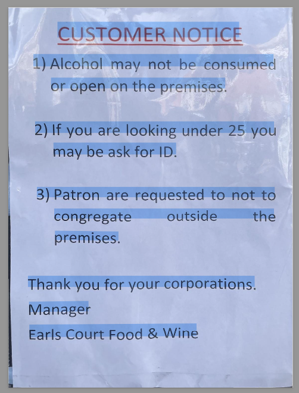

# Team Project Report

## Achievement Overview:
Our team has successfully implemented an algorithm to flatten images of documents and extract textual information using optical character recognition (OCR). Using various computer vision algorithms, we separate the image of a document from it's background, align it and perform OCR. Specifically, we have achieved the following:

- Used morphology operations to remove detail/text from a document to aid edge detection.
- Implemented Canny edge detection and contour finding to identify document edges.
- Applied the Ramer-Douglas-Peucker algorithm for corner detection to determine the quadrilateral representing the document boundaries.
- Conducted a perspective transform using Homography to align the document.
- Performed Optical Character Recognition on the identified document.

Both team members actively contributed to coding, debugging, and documenting the project.

## Special Instructions:
To replicate our results and run the application locally, please follow these instructions:

1. Clone the repository to your local machine.
2. Ensure that you have the necessary Python libraries installed: OpenCV, NumPy, Matplotlib and OCRmyPDF. You can install these by runnning `pip install -r requirements.txt`.
3. Add your input images to the img directory within the project.
4. Run the Python script to execute the document alignment process. Change the `image_name` to match the desired input image.
5. View the output displayed using Matplotlib to observe the aligned document. The OCR output in saved in the project root directory.

## Evidences of Functionality:

Below the original image, identified edges and resulting image transformation can be seen.

Once transformed, OCR is performed to identify text in the image, and append it on a transparent layer in a PDF. Below this text has been highlighted to show the successful output.

## Application Evaluation:
### What Our Application Can Do:
- Perform document alignment using morphological operations, edge detection, contour finding, corner detection, and perspective transform techniques.
- Handle various document orientations and sizes.
- Achieve accurate alignment results in most cases.
- Perform OCR on the document.

### What Our Application Cannot Do:
- Handle extremely skewed or distorted documents, or documents with non-straight (i.e. curved/distorted edges).
- Handle documents where all four corners are not visible, or with noisy backgrounds.
- Guarantee perfect alignment in all scenarios, especially when dealing with highly complex document layouts.
- Perform OCR on handwriting.

---

# Personal Statements

## Jack's Personal Statement:

### Personal Contribution:
In this project, I primarily focused on implementing the corner detection using the Douglas-Peucker algorithm and the perspective transform using homography. I contributed to coding these functionalities, debugging, and ensuring their integration with the overall project. I furthermore implemented the OCR functionality.

### Reflection:
Throughout this project, I've learned a great deal about the practical application of computer vision techniques in real-world scenarios. Specifically, diving deep into corner detection algorithms expanded my understanding of geometric transformations and image processing. Moreover, working collaboratively with my team member allowed me to enhance my GitHub skills. Having used a number of OCR tools for my Masters project, integrating this was quite an easy task.

### Design Decisions:
One of the key design decisions I made was to utilize the Douglas-Peucker algorithm for corner detection due to its efficiency and accuracy in identifying key points in the document contours. Additionally, opting for homography-based perspective transform provided a robust method for aligning documents.

### Mistakes and Lessons Learned:
One mistake I made during the project was underestimating the complexity of fine-tuning parameters for the corner detection algorithm. This led to some initial inaccuracies in corner localization, which required iterative adjustments and testing. This experience taught me the importance of thorough parameter tuning and testing before finalising implementation.

### Future Improvements:
In the future, I would explore alternative solutions to make the OCR work with handwriting.

## James's Personal Statement:

### Personal Contribution:
In this project, my primary contributions revolved around implementing the algorithms which find the outline of the page: morphology operations to remove detail, Canny edge detection to find edges, and contour finding algorithms to find complete document edges. I also compiled the code together and appropriately documented it.

### Reflection:
Engaging in this project provided me with valuable insights into the practical applications of computer vision algorithms, especially in document processing tasks. Implementing morphology operations and edge detection techniques deepened my understanding of image preprocessing steps crucial for subsequent analysis. 

### Design Decisions:
A key design decision I made was to apply morphological operations remove document detail for document alignment - this ensured the size of the document was unchanged but regions of text are 'closed'. Additionally, opting for Canny edge detection followed by contour finding allowed us to accurately identify document boundaries, paving the way for further processing steps.

### Mistakes and Lessons Learned:
Similarly to Jack, fine-tuning the paramaters such as the exact size (6x6) of the kernel for morphological closing operation turned out to be the biggest challenge, as it proved to be a challenge to make the edge detection work on a wide range of images. I also found it a challenge to learn how to implement operations I have used in MATLAB in their Python equivalents - but overall this was worth it due to the extra functionality of the available OCR packages in Python.

### Future Improvements:
If I were to do this project again, I would invest more time upfront in understanding and experimenting with parameter settings for corner detection, and explore alternative solutions to make the code work with noisy backgrounds. The homography transform was also the slowest part of the code, and required severly downscaling the resolution of the image, which is an aspect of the project which could be further optimised.

